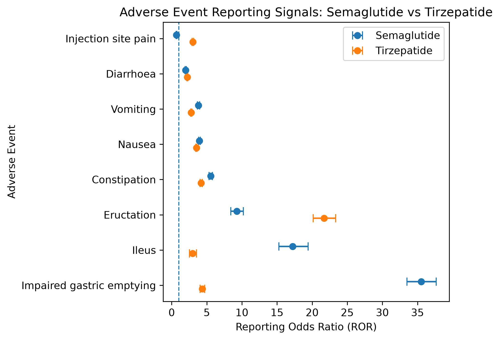
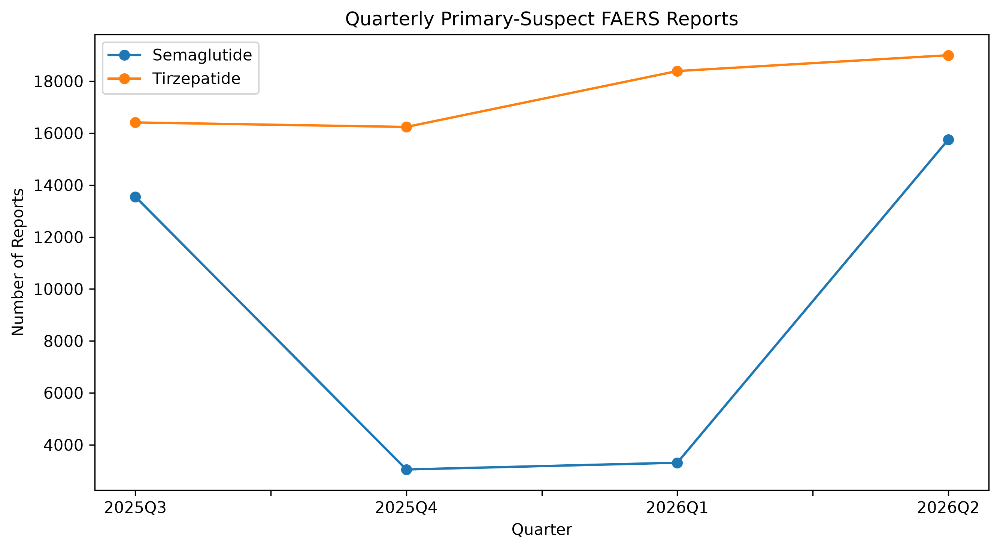
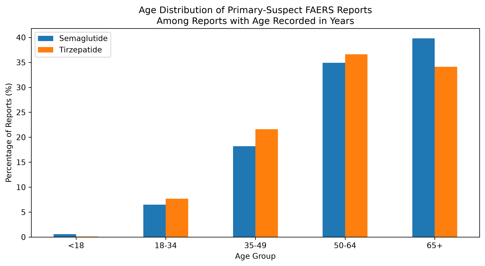

# GLP-1 Drug Safety Signal Analysis Using FDA FAERS

A reproducible pharmacovigilance analysis comparing adverse-event reporting patterns for **semaglutide** and **tirzepatide** using four quarters of FDA Adverse Event Reporting System (FAERS) data.

## Research Question

**Do semaglutide and tirzepatide show different adverse-event reporting signal profiles in FDA FAERS reports?**

This project analyzes FAERS reports from **2025 Q3 through 2026 Q2**, focusing on cases where semaglutide or tirzepatide was identified as the **Primary Suspect (PS)** drug. Updated cases are deduplicated by retaining the latest available case version.

The analysis combines:

- SQL and DuckDB for multi-table FAERS processing and case deduplication
- Reporting Odds Ratios (ROR) for disproportionality analysis
- 95% confidence intervals calculated in Python
- Demographic and quarterly reporting-pattern analysis
- Validation against known gastrointestinal adverse-event signals

## Key Findings

After deduplicating FAERS cases to retain the latest case version and restricting the analysis to reports where each drug was the Primary Suspect (PS), the dataset contained:

- **35,666 semaglutide reports**
- **70,037 tirzepatide reports**

### Pre-specified Clinical Outcome Groups

Four clinically relevant adverse-event groups were defined before the final comparison:

| Clinical Outcome Group | Semaglutide ROR (95% CI) | Tirzepatide ROR (95% CI) |
|---|---:|---:|
| Common GI symptoms | 3.45 (3.36–3.54) | 3.12 (3.06–3.18) |
| GI motility / obstruction | 18.65 (17.80–19.54) | 2.84 (2.67–3.03) |
| Gallbladder events | 5.82 (5.27–6.42) | 3.72 (3.40–4.07) |
| Pancreatitis | 5.17 (4.74–5.64) | 3.46 (3.20–3.74) |

All four outcome groups showed reporting disproportionality (ROR > 1 with 95% CIs above 1) for both drugs relative to other reports in the FAERS dataset.

The largest difference in reporting profiles occurred for **GI motility / obstruction events**, with an ROR of **18.65** for semaglutide compared with **2.84** for tirzepatide. These RORs should not be interpreted as a direct estimate of relative risk between the two drugs.

### Known-Signal Validation

As a validation step, the pipeline was tested against common gastrointestinal adverse events. It successfully recovered elevated reporting signals for nausea, vomiting, diarrhoea, and constipation for both drugs.

For example:

- Semaglutide nausea: **ROR 3.96 (95% CI 3.84–4.09)**
- Tirzepatide nausea: **ROR 3.51 (95% CI 3.43–3.60)**
- Semaglutide constipation: **ROR 5.57 (95% CI 5.33–5.82)**
- Tirzepatide constipation: **ROR 4.20 (95% CI 4.05–4.36)**

Recovering these established gastrointestinal reporting patterns provides a sanity check that the data-processing and disproportionality pipeline behaves as expected.

## Visualizations

### 1. Adverse-Event Reporting Signals

The forest-style plot compares Reporting Odds Ratios (RORs) and 95% confidence intervals for selected adverse events reported with semaglutide and tirzepatide. The vertical reference line at ROR = 1 represents no reporting disproportionality relative to the FAERS background.



### 2. Quarterly Reporting Patterns

Primary-suspect report counts were summarized by quarter after retaining the latest available version of each FAERS case.



Tirzepatide report counts were relatively stable across the four-quarter period, while semaglutide showed substantial variation. These counts reflect FAERS reporting patterns and should not be interpreted as changes in adverse-event incidence.

### 3. Age Distribution

Among reports with age recorded in years, both drugs had the largest shares of reports in the 50–64 and 65+ age groups.



Age distributions describe the composition of submitted FAERS reports and do not estimate age-specific adverse-event risk.

## Data

Data were obtained from the **FDA Adverse Event Reporting System (FAERS)** quarterly ASCII files for:

- 2025 Q3
- 2025 Q4
- 2026 Q1
- 2026 Q2

The analysis primarily uses three FAERS tables:

| Table | Purpose | Key Fields |
|---|---|---|
| `DEMO` | Report and patient information | `primaryid`, `caseid`, `caseversion`, `age`, `sex` |
| `DRUG` | Drug exposure and role information | `primaryid`, `prod_ai`, `role_cod` |
| `REAC` | Reported adverse reactions | `primaryid`, `pt` |

Raw FAERS files are not included in this repository because of their size.

## Methodology

### 1. Multi-Quarter Data Processing

DuckDB was used to query the raw `$`-delimited FAERS ASCII files directly without loading the full multi-million-row dataset into memory.

Files from all four quarters were queried using wildcard paths such as:

```sql
read_csv(
    'data/raw/*/DRUG*.txt',
    delim='$',
    header=true
)

### 2. Case-Version Deduplication

A FAERS case may be updated and appear in multiple quarterly files. Counting every version would therefore overcount some cases.

Cases were ranked by `caseversion` within each `caseid`, and only the latest available version was retained:

```sql
RANK() OVER (
    PARTITION BY caseid
    ORDER BY caseversion DESC
) AS version_rank
```

Only rows with `version_rank = 1` were carried forward into the analysis.

### 3. Primary-Suspect Drug Selection

The deduplicated reports were joined to the `DRUG` table using `primaryid`.

The primary analysis was restricted to reports where the drug was identified as the Primary Suspect:

```sql
WHERE role_cod = 'PS'
  AND prod_ai IN ('SEMAGLUTIDE', 'TIRZEPATIDE')
```

This resulted in **35,666 semaglutide** and **70,037 tirzepatide** primary-suspect reports.

### 4. Adverse-Event Group Definitions

Four clinical outcome groups were defined for the primary comparison:

| Outcome Group | Included MedDRA Preferred Terms |
|---|---|
| Common GI symptoms | Nausea, Vomiting, Diarrhoea, Constipation |
| Pancreatitis | Pancreatitis, Pancreatitis acute |
| Gallbladder events | Cholelithiasis, Cholecystitis, Cholecystitis acute |
| GI motility / obstruction | Impaired gastric emptying, Ileus, Intestinal obstruction |

Within each outcome group, a report was counted only once even if it contained multiple included Preferred Terms.

`Gastroparesis` was initially considered for the motility group but was excluded because the dataset did not contain the general Preferred Term; only more specific terms such as diabetic and postoperative gastroparesis were observed.

### 5. Reporting Odds Ratio

For each drug and adverse-event outcome, a 2 × 2 contingency table was constructed:

| | Outcome Present | Outcome Absent |
|---|---:|---:|
| Target drug | a | b |
| Other FAERS reports | c | d |

The Reporting Odds Ratio (ROR) was calculated as:

**ROR = (a × d) / (b × c)**

In SQL:

```sql
(a * d * 1.0) / (b * c) AS ror
```

An ROR greater than 1 indicates that the outcome was reported disproportionately more often with the target drug than in the comparator FAERS reports.

ROR measures **reporting disproportionality**, not incidence, absolute risk, or causality.

### 6. 95% Confidence Intervals

Confidence intervals were calculated in Python on the log-ROR scale:

**SE(log ROR) = sqrt(1/a + 1/b + 1/c + 1/d)**

**95% CI = exp(log(ROR) ± 1.96 × SE)**

The implementation used NumPy:

```python
result["se_log_ror"] = np.sqrt(
    1 / result["a"]
    + 1 / result["b"]
    + 1 / result["c"]
    + 1 / result["d"]
)

result["ci_lower"] = np.exp(
    np.log(result["ror"])
    - 1.96 * result["se_log_ror"]
)

result["ci_upper"] = np.exp(
    np.log(result["ror"])
    + 1.96 * result["se_log_ror"]
)
```

### 7. Descriptive Analysis

Additional analyses examined:

- Most frequently reported adverse events
- Sex distribution
- Age distribution among reports with age recorded in years
- Quarterly primary-suspect report counts
- Individual MedDRA Preferred Term RORs for exploratory and validation analyses

Age analysis was restricted to reports where age was recorded in years (`age_cod = 'YR'`) and age was non-missing.

The individual Preferred Term analysis was used separately from the pre-specified grouped analysis. Common gastrointestinal reactions such as nausea, vomiting, diarrhoea, and constipation were used as known-signal validation checks.

## Limitations

FAERS is a spontaneous reporting system, so the results should be interpreted as **reporting signals rather than estimates of adverse-event risk or causality**.

Key limitations include:

- **No exposure denominator:** FAERS does not provide the total number of patients taking each drug. Report counts and RORs therefore cannot be interpreted as incidence rates or absolute risks.
- **Reporting bias:** Adverse events may be underreported or disproportionately reported because of publicity, regulatory attention, severity, or other factors.
- **Confounding:** Differences between semaglutide and tirzepatide reports may reflect differences in patient populations, indications, dose, duration of treatment, prescribing patterns, or other factors that were not controlled for in this analysis.
- **ROR is not relative risk:** A larger ROR for one drug does not mean that patients taking that drug are proportionally more likely to experience the event than patients taking the other drug.
- **Comparator definition:** Each drug-specific ROR was calculated relative to other deduplicated reports in the FAERS dataset. The two drug-specific RORs therefore provide a comparison of reporting profiles, not a direct head-to-head treatment effect.
- **Case updates:** Cases were deduplicated using the latest available `caseversion` within the four-quarter study window. Quarterly trends therefore represent the quarter associated with the retained latest version and may not correspond to the original onset or first reporting quarter.
- **Missing demographic data:** Age and sex are not complete for all FAERS reports. Age-distribution analysis was restricted to reports with age recorded in years.
- **MedDRA term selection:** Clinical outcome groups depend on the selected Preferred Terms. Different definitions could change group-level results.

These analyses are intended for **signal detection and exploratory pharmacovigilance**, not for determining whether a drug caused an adverse event or whether one drug is clinically safer than another.

## Project Structure

```text
glp1-faers-signals/
├── data/
│   ├── raw/                         # Raw FAERS quarterly files (not tracked)
│   ├── glp1_ror_comparison.csv      # Individual PT comparison results
│   └── clinical_group_ror.csv       # Pre-specified clinical group ROR results
│
├── figures/
│   ├── glp1_ror_comparison.png
│   ├── quarterly_reporting_trend.png
│   └── age_distribution.png
│
├── scripts/
│   ├── explore_data.py
│   ├── calculate_ci.py
│   ├── calculate_group_ci.py
│   ├── visualize_results.py
│   ├── visualize_quarterly_trend.py
│   └── visualize_demographics.py
│
├── sql/
│   ├── 01_top_drugs.sql
│   ├── 02_top_reactions.sql
│   ├── 03_glp1_sample.sql
│   ├── 04_check_reactions.sql
│   ├── 05_glp1_reactions.sql
│   ├── 06_check_multi_quarter.sql
│   ├── 07_check_case_versions.sql
│   ├── 08_glp1_report_counts.sql
│   ├── 09_ror_nausea.sql
│   ├── 10_semaglutide_ror.sql
│   ├── 11_tirzepatide_ror.sql
│   ├── 12_demographics.sql
│   ├── 13_quarterly_trend.sql
│   ├── 14_check_clinical_outcomes.sql
│   └── 15_clinical_group_ror.sql
│
├── README.md
├── LOG.md
└── .gitignore
```

## How to Reproduce

### 1. Download FAERS Data

Download the quarterly ASCII files from the FDA FAERS database for:

- 2025 Q3
- 2025 Q4
- 2026 Q1
- 2026 Q2

Place the extracted quarterly files under:

```text
data/raw/
```

using a structure such as:

```text
data/raw/
├── 2025Q3/
├── 2025Q4/
├── 2026Q1/
└── 2026Q2/
```

The analysis expects the FAERS `DEMO`, `DRUG`, and `REAC` ASCII files to be available within these folders.

### 2. Install Python Dependencies

The project requires Python and the following packages:

```bash
pip install duckdb pandas numpy matplotlib
```

### 3. Run the SQL Analysis

The SQL files in `sql/` document the analysis from initial data exploration through the final disproportionality analysis.

The main final analysis is:

```text
sql/15_clinical_group_ror.sql
```

It performs:

1. Latest-case-version deduplication
2. Primary-suspect drug filtering
3. Clinical outcome grouping
4. Construction of 2 × 2 contingency tables
5. ROR calculation

### 4. Calculate 95% Confidence Intervals

Run:

```bash
python scripts/calculate_group_ci.py
```

This executes the clinical-group SQL analysis, calculates log-scale 95% confidence intervals, and writes:

```text
data/clinical_group_ror.csv
```

For the individual MedDRA Preferred Term analysis, run:

```bash
python scripts/calculate_ci.py
```

### 5. Generate Visualizations

Generate the ROR comparison figure:

```bash
python scripts/visualize_results.py
```

Generate the quarterly reporting trend:

```bash
python scripts/visualize_quarterly_trend.py
```

Generate the age-distribution figure:

```bash
python scripts/visualize_demographics.py
```

The resulting figures are saved under:

```text
figures/
```

## Tech Stack

- **SQL** — joins, CTEs, window functions, aggregation, deduplication, and contingency-table construction
- **DuckDB** — direct querying of multi-quarter FAERS ASCII files
- **Python** — statistical calculations and analysis workflow
- **Pandas** — result manipulation and reshaping
- **NumPy** — ROR confidence-interval calculations
- **Matplotlib** — statistical and descriptive visualizations
- **Git / GitHub** — version control and project documentation